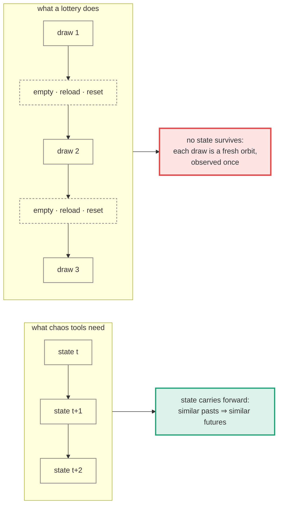
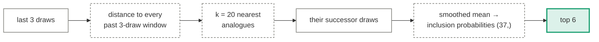

# Chaos theory

*The machine is deterministic. Balls obey Newton, not dice gods. Chaos theory was built for
exactly this — deterministic systems that look random — so its tools should recover the
structure that mere statistics misses.*

This is the best-motivated approach in the repository, because its physical premise is
simply **correct**. The lottery machine *is* a chaotic deterministic system. If you knew the
exact state of the chamber — positions, velocities, spins — the draw would be computable.
Nothing quantum stands in the way. So this page takes the strongest tools chaos theory owns
and points every one of them at the draw sequence.

  <i></i>data
  <i></i>fixed operation
  <i></i>output
  <i></i>where it breaks

## The one assumption everything rests on

Every cross-draw chaos tool — Takens embedding, attractor reconstruction, analogues —
requires the observations to be successive measurements of **one evolving trajectory**.
That is the hypothesis of Takens' theorem, not a convenience.

The chaos is real, but it lives *inside* a draw, on millisecond timescales. And its defining
property — exponential sensitivity — is precisely what guarantees the reset erases
everything: an immeasurably small difference in how the balls are loaded grows past
macroscopic within a few collisions. The machine's chaos is not an obstacle to this
approach that might be overcome. It is the mechanism that makes each draw independent of
the last.

That is the theory. The measurements below check it, because the theory could be wrong —
imperfect mixing, worn balls, an operator's loading habit would all leave cross-draw state,
and every instrument here would light up.

## Instrument 1: is there an attractor?

Chaotic systems concentrate on low-dimensional attractors. The Grassberger–Procaccia
correlation dimension, computed on Takens embeddings of increasing dimension *m*, saturates
at the attractor's dimension for chaos and keeps climbing with *m* for noise — noise fills
whatever space you embed it in.

| m | Draw sums | Logistic map (chaos, D₂ = 1) | iid noise |
|--:|--:|--:|--:|
| 1 | 0.98 | 0.79 | 0.97 |
| 2 | 1.79 | 0.90 | 1.79 |
| 3 | 2.47 | 1.06 | 2.46 |
| 4 | 3.06 | 1.41 | 3.02 |
| 6 | 4.08 | 2.65 | 3.97 |
| 8 | 4.92 | 4.24 | 4.78 |

The logistic map pins to ≈ 1, exactly as theory says. The draw sums track the noise column
almost digit for digit — 2.47 vs 2.46, 3.06 vs 3.02 — climbing without saturation. There is
no attractor here; a Theiler window excludes temporal neighbours so autocorrelation cannot
pose as geometry. (The drift upward in the logistic column at high *m* is the known
small-sample degradation of the estimator at n = 1,629 — visible in a control, which is why
controls are run.)

## Instrument 2: do similar pasts have similar futures?

Lorenz's **method of analogues** — the original weather-forecasting idea, and a genuine
short-horizon predictor for real chaotic systems. Find the k = 20 past 3-draw windows most
similar to the current one; predict the next draw as the average of what followed them.

First, proof the instrument works: on a deterministic 7-cycle control it scores a perfect
**6.000 / 6** — where similar pasts genuinely have similar futures, this method finds them.
On the real archive, the shipped predictor scores **0.923** over the 300-draw scoreboard
window, against chance of 0.973 (the exact value reshuffles with every rebuild — the
[scoreboard](../results.md) carries the current one). Its twenty "nearest analogues" are
nearest by coincidence, and their successors are just twenty random draws.

It runs on the [scoreboard](../results.md) as a full participant, with honest probabilities
(smoothed successor frequencies, summing to exactly 6).

## Instrument 3: the surrogate-data test

The canonical chaos-vs-noise hypothesis test, now the ninth entry in the
[randomness suite](../evaluation.md). Shuffle the draw order — this destroys any dynamics
completely while preserving the composition exactly — and ask whether the real ordering
out-predicts its own shuffles.

| | Analogue skill |
|---|--:|
| Real ordering | 0.883 |
| Mean of 40 shuffled surrogates | 0.970 |
| p (real ≥ surrogates) | **0.85** |

The real ordering predicts no better than its shuffles — on this run, slightly worse, which
is itself just noise. On the deterministic control the same test fires at the smallest
reachable p, so the null result is a measurement, not blindness
(`test_surrogate_test_detects_determinism` pins both directions).

## Where chaos exploitation actually works

This page would be dishonest without the contrast, because chaos-based gambling prediction
has real successes: Thorp and Shannon's wearable roulette computer, the Eudaemons, and Small
& Tse's 2012 demonstration all beat roulette. Every one of them worked the same way —
**measuring the initial conditions of the very spin being bet on**, wheel and ball, in the
seconds before betting closed, then integrating the (briefly) predictable dynamics.

That is the regime where determinism pays: *observe the current run's state before the
outcome closes*. A lottery reveals nothing about the current draw before it happens — no
observation, no state, no horizon to exploit. Chaos theory does not fail here because the
mathematics is wrong. It fails because the lottery, unlike a roulette table, never lets you
see the thing the mathematics needs.

## Verdict

| Instrument | Chaos would show | Measured |
|---|---|---|
| Correlation dimension | saturation at low D₂ | climbs like noise, no attractor |
| Method of analogues | skill above chance | 0.923 vs 0.973 on the current build — chance |
| Surrogate data | real ordering beats shuffles | p = 0.85 — indistinguishable |

Three instruments, each validated on a control where chaos (or determinism) is genuinely
present, each silent on the archive. The premise was right — the machine is deterministic
and chaotic — and that is exactly why the sequence it emits carries nothing from draw to
draw.

---

Full scoreboard: [Results](../results.md).
