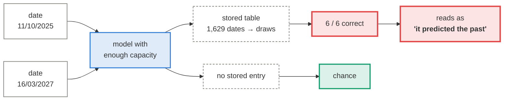
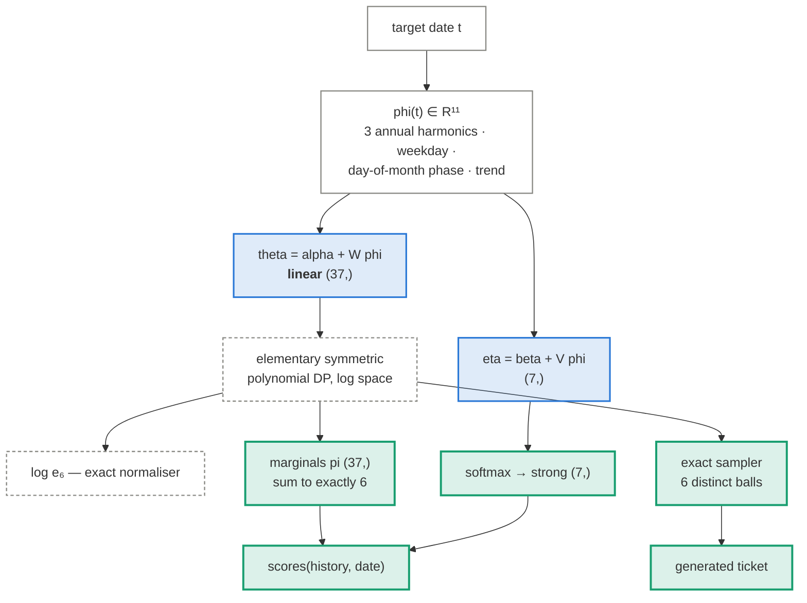

# Date-conditioned generative model

!!! abstract "The concept, in a minute"

    **The idea.** The draw is a function of *when* it happens. Type in any date — past or
    future — and generate that round's numbers.

    **How it works.** A generative model assigns each of the 37 numbers a probability that
    depends only on the date (season, weekday, long-term trend), normalised exactly over
    all valid 6-number sets, with an exact sampler. Crucially the date enters through a
    *linear* map — the one design that provably cannot memorise individual dates, because
    adjusting the fit for one date moves all 1,600 others.

    **What it teaches.** There is exactly one draw per date, so the date is a *unique key*:
    an unconstrained model just stores a date→draw table and "predicts" the past perfectly.
    Our deliberate lookup control scores **6/6** on any past date and exactly chance on
    unseen ones. Reproducing the past is storage; only the walk-forward column is about the
    future — and there, with 63 hypothesis tests finding no date effect, the model is
    indistinguishable from a fair lottery.

Type in a date — past or future — and this generates that round's ticket. It is the only
model here that never looks at the preceding draws. It reads a calendar.

Which makes it the most dangerous model in the repository, for a reason that has nothing to
do with lotteries.

<div class="role-key">
  <span class="k-data"><i></i>data</span>
  <span class="k-learn"><i></i>learned weights</span>
  <span class="k-op"><i></i>fixed operation</span>
  <span class="k-out"><i></i>output</span>
  <span class="k-flaw"><i></i>the trap</span>
</div>

## The unique-key problem

There is **exactly one draw per calendar date**. So the date is a unique key into the
training set, and a model with enough capacity does not need to learn anything — it can
store a lookup table and read the answer back.

Ask such a model for 11/10/2025 and it returns that draw perfectly. That looks like
prophecy. It is compression.



The whole design is organised around making that failure **measurable** instead of letting
it be reported as a result.

## The guard is the function class, not the feature count

The instinct is to limit capacity by using few date features. That does not work. Our date
basis contains a linear time trend, which makes it **injective** over the 1,629 training
dates — every date maps to a distinct point. A unique key in a smooth costume. Feed that
into a neural head with a few thousand weights and it can absorb the entire answer key
(1,629 × ln C(37,6) = 23,880 nats ≈ 4.3 KB), no matter how few features you named.

What actually bounds capacity is **linearity**. Ball logits are linear in the date basis:

\[
\theta_i(t) = \alpha_i + w_i \cdot \phi(t)
\]

A linear head cannot spike on one date. Moving a coefficient to fit 11/10/2025 moves all
1,628 other dates too. `test_head_is_linear` fails the build if anyone inserts a hidden
layer, and `test_trend_makes_the_basis_injective` records that the trend *is* a unique key
so the decision stays reviewed rather than forgotten.

## The model

Conditional-Bernoulli over the 37 balls with the set size fixed at exactly 6:

\[
P(S \mid t) = \frac{\prod_{i \in S} e^{\theta_i(t)}}{e_6\!\left(e^{\theta(t)}\right)}, \qquad |S| = 6
\]

where \(e_6\) is the elementary symmetric polynomial, computed in log space by an
\(O(37 \times 6)\) dynamic program.



Everything is closed form — normaliser, marginals, gradients, sampler. No MCMC, no
variational bound, no random seed hiding in a hyperparameter. The objective is convex, so
fitting is deterministic: one optimum, no epochs, no early stopping. That also removes an
entire class of leak, since there is no stopping criterion that could peek at the target.

The marginals sum to exactly 6, so dividing by 6 gives a genuine categorical distribution
rather than a rescaling of arbitrary scores. That is what earns
`emits_probabilities = True` and lets it report log loss at all — see
[the scoring rules](../evaluation.md#the-two-scoring-rules).

**The fair lottery is a nested point of this model** (\(W = 0\), \(\alpha\) constant), so
"no date effect" is a parameter value it can land on exactly, not merely approach.

### What the date basis excludes, and why

| Excluded | Reason |
|---|---|
| Inter-draw gap | Not computable for a date a user types without consulting the real schedule — a direct look at the future. Provably null anyway (all five gap tests, Holm p = 1.000). |
| Row index / draw ordinal | That is a position in the archive, not a property of the date, and it reveals where the target sits relative to the data end. |
| Time of day | There is none. Every timestamp in the archive is midnight; the source publishes dates only. |

## Is there anything to condition on?

Before building this, a team of agents ran **63 hypothesis tests** across five independent
families, each against an exact or Monte-Carlo null with multiplicity correction.

| Family | Tests | Smallest corrected p | Effect |
|---|---:|---:|---|
| Day of week | 10 | 0.727 | none |
| Seasonality (month, day-of-year, week, holidays) | 21 | 0.105 | none |
| Drift and changepoints | 6 | 0.603 | none |
| Inter-draw gap | 5 | 1.000 | none |
| Date numerology (day-of-month in draw, etc.) | 21 | 1.000 | none |

Two details worth keeping. The best apparent changepoint, at 2012-12-06, sits comfortably
inside a 2,000-replicate time-permutation null (p = 0.128) — it is an artefact of maximising
over ~1,500 candidate splits. And the day-of-month appears among the drawn balls **236 times
against 264.2 expected** — less often than chance, the opposite of the folk hypothesis.

## The result

=== "What it does"

    | Model | DKRR (in-sample) | Walk-forward matches |
    |---|---:|---:|
    | Date-conditioned CB | **1.263** / 6 | 0.933 |
    | Date lookup table (control) | **6.000** / 6 | 0.930 |
    | Chance | 0.973 | 0.973 |

    The control reconstructs **every** past draw perfectly and is worth exactly nothing on a
    date it has not seen. The real model shows a milder version of the same thing: 1.263
    in-sample against an in-sample 2σ band of 0.973 ± 0.042 is capacity, not skill.

=== "What it means"

    **DKRR** — Date-Keyed Reconstruction Rate — is matched numbers on dates the model was
    *trained on*. It is a compression statistic, not a prediction statistic: it measures how
    much of the training targets was absorbed into the parameters. It is never displayed
    without the walk-forward column beside it.

    6.000/6 reads to a non-statistician as "solved". 1.263 reads as "30% better than
    chance". Both are storage. The walk-forward column is the only one that is about the
    future.

The in-sample gain comes with an **analytic reference point**, which is the useful part.

Counting parameters gives \(37 \times 11 + 7 \times 11 = 484\) date coefficients, but 22 of
those directions do not exist. For each feature, adding the same constant to *every* ball
logit leaves the size-6 conditional-Bernoulli distribution untouched — the normaliser absorbs
it exactly — and the softmax has the identical invariance. So there are **462** identifiable
date directions, not 484. (`test_constant_logit_shift_is_unidentifiable` verifies this to
machine precision, and it is why the count is stated rather than assumed.)

Under the null an unpenalised fit would then give \(2\Delta\ell \sim \chi^2_{462}\), so the
expected in-sample overfit is 231 nats — **0.142 nats/draw**. Two caveats keep that honest:
it applies to the *unpenalised* fit, and ridge shrinkage means the realised gain must come in
strictly below it. So 0.142 is an upper reference, not a prediction of what we should see.

The measured gain is **0.107 nats/draw** — below the bound, as shrinkage requires. A gain
sitting at or above the unpenalised bound would mean the model is fitting more than 462
directions' worth of noise, which a correctly specified ridge fit cannot do: that is the
tripwire, and it is a live check rather than a footnote.

## How to read the walk-forward number

The honest phrasing, fixed in advance so it cannot be spun afterwards:

> Walk-forward performance of the date-conditioned generative model is statistically
> indistinguishable from the fair 6/37 null: 0.933 matched numbers against a baseline of
> 0.973 (p = 0.413), and log loss 3.635 against ln 37 = 3.611.

Two phrasings are **banned**, and the docs say so out loud:

- *"The model has no predictive power"* — this is an upper bound on an effect, not proof of
  zero. The test has 2σ power to detect roughly 0.067 matched numbers per draw; smaller
  effects are not excluded.
- *"The model concluded the date is uninformative"* — it concluded nothing. It was
  regularised toward the null, and would have been on a dataset containing real signal below
  the detection threshold.

## Generating a ticket

```python
from bench.data import load
from bench.generative import DateConditionedCB

model = DateConditionedCB()
model.fit(load())
model.sample("2027-03-16")
# {'date': '2027-03-16', 'numbers': [3, 11, 19, 24, 30, 36], 'strong': 4,
#  'in_sample': False, 'label': 'out-of-sample generation'}

model.sample("2025-10-11")          # a date it was trained on
# {..., 'in_sample': True, 'label': 'in-sample reconstruction, not a prediction'}
```

The `in_sample` flag is the safeguard, not decoration. Without it a screenshot of the box
pointed at a past date is indistinguishable from a forecast.

`scores(history, target_date)` raises `LeakageError` if the target is not strictly after
every draw the model was **fitted** on. Checking the caller's `history` argument alone would
not be enough: fitting on the whole archive and then passing a truncated history would sail
straight through, which is exactly how an in-sample number becomes a headline.

The published report shows this model's pick for the **next scheduled draw**, inferred from
the recent Tuesday/Saturday cadence rather than hard-coded — the one call where it is
forecasting rather than reconstructing.

## Why this model earns its place

It is the clearest demonstration in the repository of the difference between **fitting** and
**predicting**. Every other approach here fails to beat chance in a way that is easy to
accept. This one *succeeds* spectacularly at something worthless, and the gap between its
two columns is the lesson.

---

Measured results: [Results](../results.md).
