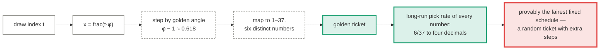

# The golden ratio

*φ organises sunflower heads, pinecones, spiral galaxies and quasicrystals. Nature's
favourite constant should leave fingerprints on other numbers too — find them in the draw
history and you have an edge.*

People reach for φ with reason: unlike most numerology, the golden ratio genuinely does
organise physical systems. So this page does what the [chaos page](chaos.md) did — grants
the premise, states what φ would have to do here, and measures it. The finding is an
inversion worth the whole page: φ's actual mathematical superpower is the *opposite* of
what the folk theory needs, and that opposite turns out to be the one thing a lottery
player can genuinely use.

  <i></i>data
  <i></i>fixed operation
  <i></i>output
  <i></i>where it breaks

## What φ actually is, mathematically

φ is the **most irrational number**: by Hurwitz's theorem it is the constant worst
approximated by fractions — its continued fraction is all 1s, so it never comes close to
settling into a ratio. That is precisely why the rotation frac(n·φ) spreads points more
evenly than any other. Measured on our archive length:

| Rotation constant | Discrepancy at n = 1,629 (lower = more even) |
|---|---:|
| **φ** | **0.0010** |
| √2 | 0.0013 |
| e | 0.0018 |
| π | 0.0101 |
| 22/7 (near-rational) | 0.1433 |

φ wins. In a sunflower this is the point: each new seed lands maximally far from every
earlier one. **φ is the constant of maximal pattern *avoidance*.** Asking it to reveal
patterns in a lottery inverts its one superpower.

## The folk hypotheses, measured

Four ways φ could mark the draws, each against an exact or Monte-Carlo null:

| Hypothesis | Measured | Verdict |
|---|---|---|
| Fibonacci numbers (1, 2, 3, 5, 8, 13, 21, 34) drawn unusually often | 2,151 appearances vs 2,113 expected — **+0.93 sd**; per-draw Fibonacci count fits the hypergeometric at p = 0.78 | noise |
| Gaps inside a draw form φ ratios | 5.85% of consecutive-gap ratios within ±0.15 of φ, vs 5.67% ± 0.28% in fair simulations — **z = +0.64** | noise |
| Consecutive draw sums in φ ratio | 2.64% near φ vs 2.32% ± 0.35% fair | noise |
| Golden-section board positions 23 (= 37/φ) and 14 (= 37/φ²) favoured | #23 at −0.35 sd; #14 at **−2.23 sd** — *under*-drawn, and just the expected minimum among 37 numbers | noise |

Nothing golden survives. (Rejected without measuring, as re-skins of tests already run:
Fibonacci retracement levels on the sum series — the φ-ratio test above in trader's
clothing; Zeckendorf digit statistics and Beatty-sequence membership — fixed-subset tests
identical in form to the Fibonacci row.)

## The strongest honest predictor φ can build

The Kronecker/golden-angle schedule — the exact construction φ is famous for, mapped onto
the board: start at frac(t·φ), step by the golden angle, take six numbers.

φ's own equidistribution is the punchline: the schedule's long-run pick rate per number is
6/37 to four decimals (`test_golden_schedule_is_equidistributed` pins it). The better φ
does its job, the more exactly this predictor converges to a uniformly random ticket.

Walk-forward, 300 held-out draws: **1.037** matches (p = 0.19) for the golden schedule,
**0.970** (p = 0.95) for the fixed Fibonacci ticket, against chance 0.973. Both on the
[scoreboard](../results.md) as labelled controls.

## The one honest job for φ

Here the page turns around, because avoidance — φ's real superpower — is the one thing
worth buying in a pari-mutuel game. Prizes are split; humans pick birthdays, clusters and
arithmetic runs; a ticket that avoids looking human wins no more often but *shares less*.
So we scored 1,000 tickets from each of three generators with the repository's own
unpopularity scorer:

| Population | Spread | Sequence avoidance | Total unpopularity |
|---|---:|---:|---:|
| **Golden-angle tickets** | **0.917** | **1.000** | **0.736** |
| Uniform random tickets | 0.867 | 0.925 | 0.703 |
| Birthday-style human picks | 0.766 | 0.892 | 0.561 |

The perfect 1.000 on sequence avoidance is not luck — it is the **three-distance theorem**:
points placed by an irrational rotation take at most three distinct gap sizes, so a golden
ticket *cannot* contain the arithmetic runs (4-8-12-16…) that crowd human play. φ beats
uniform random at being unpopular, by construction rather than by sampling.

Three honest caveats, in descending order of importance:

1. **This is a payout effect, not a prediction effect** — the same distinction as
   [ticket generators](ticket-generators.md). Odds identical; share better.
2. **The all-high ticket 32–37 still edges it** on this scorer (0.754 vs 0.736), because
   `high_numbers` carries the strongest behavioural evidence and golden tickets are
   deliberately uniform over the board. But 32-33-34-35-36-37 is itself a famous pick — a
   consecutive run in the slip's corner — which the scorer partially catches
   (sequence avoidance 0.75, spread 0.57). Golden spacing is the principled *spread*
   generator; tilting it toward high numbers would no longer be φ.
3. **A published schedule defeats itself.** If everyone plays "the golden ticket for draw
   N", they share the pot they meant to avoid. The fix is mathematically free: the spread
   guarantee is **rotation-invariant** — frac(t·φ + c) has identical discrepancy for any
   private offset c — so every player can hold their own uncrowded golden ticket.

## Verdict

φ found nothing in the draws, because there is nothing to find and because *finding
patterns is the opposite of what φ does*. Its one legitimate role in a lottery is the one
its mathematics actually supports: designing tickets that are maximally unlike everyone
else's. Nature uses φ to keep seeds out of each other's way. A lottery player can use it
to keep out of other players' way. Nobody gets to use it to see the future.

---

Full scoreboard: [Results](../results.md).
