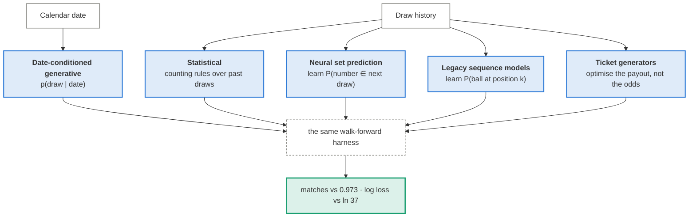
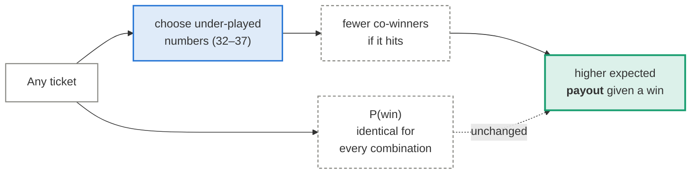

# The approaches

Every approach in this repository is one of four families. They differ in what they
*believe* about the draw, and that belief is what the diagrams make visible.

| Family | Believes | Can it beat chance? |
|---|---|---|
| [Statistical](statistical.md) | past frequencies carry information about the next draw | No — and the tests say there is nothing to carry |
| [Neural set prediction](set-prediction.md) | a network can find structure counting misses | No — it converges on the uniform prior, which is correct |
| [Legacy sequence models](legacy-models.md) | the draw is a sequence to be decoded position by position | No — and three of the four optimise a target that leaks sort order |
| [Ticket generators](ticket-generators.md) | *which* numbers you pick changes the payout, not the odds | **Yes, for payout** — the only real edge here |
| [Date-conditioned generative](date-conditioned.md) | the draw is a function of *when* it happened | No — but it reconstructs past draws perfectly, which is an instructive failure |
| [The perfect-fit function](perfect-fit.md) | one function through all past draws, extrapolated | No — three exact fits disagree about the future, and the archive contains 0 of the 23.96 bits/draw that choosing between them requires |
| [Chaos theory](chaos.md) | the machine is deterministic, so dynamics tools can recover structure | No — the premise is *true*, but the reset between draws erases the state Takens' theorem needs; no attractor, analogues at chance, surrogates indistinguishable |

## The one honest edge

Nothing predicts the draw. But the lottery is pari-mutuel: prizes are split among winners.
Players over-pick calendar dates, so numbers above 31 are systematically under-played.

This changes expected value without predicting anything. It is a fact about *players*, not
about the machine — and it is the only lever in this repository that moves the number.

---

Start with [how everything is measured](../evaluation.md), or jump to a family above.
