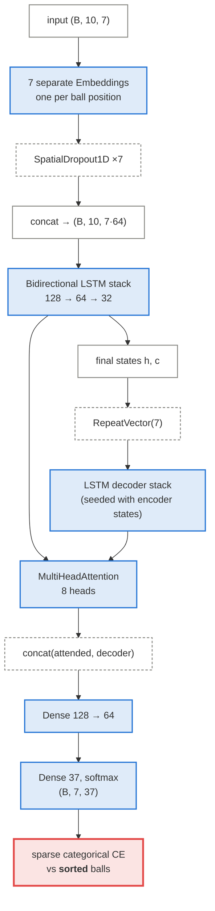
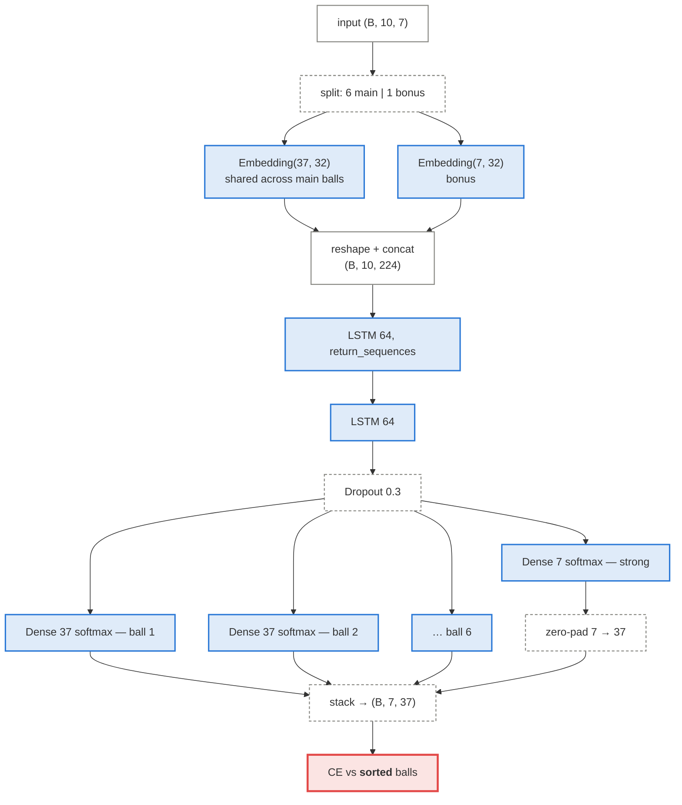
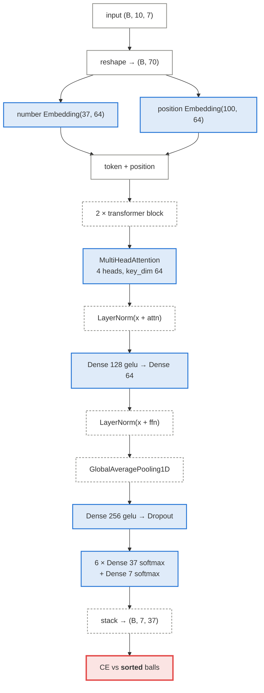
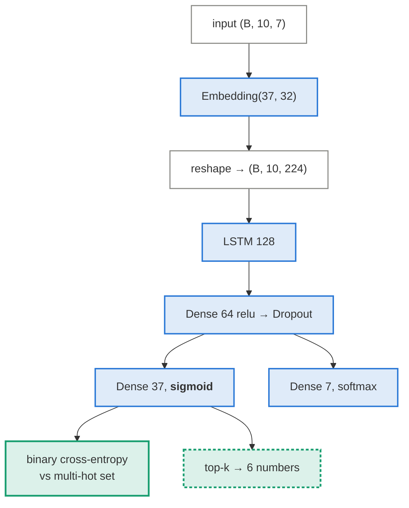
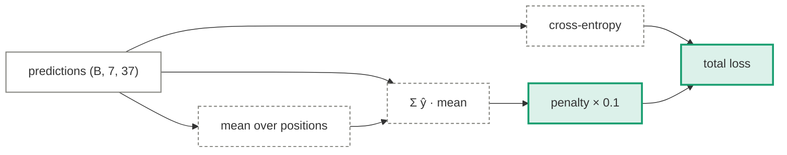

# The four legacy models

In `models.py` and `ilotto.py`, trained via `train.py --model <name>`. All four take the
same input — 10 previous draws as `(batch, 10, 7)` integer ball IDs — and, except for the
last, emit `(batch, 7, 37)`: a probability distribution per output position.

The [architecture deep dive](../reference/architectures.md) covers each layer in prose. This
page is the visual summary, plus the one structural property that decides how to read their
scores.

  <i></i>tensors
  <i></i>learned weights
  <i></i>fixed operation
  <i></i>output
  <i></i>leaks sort order

!!! warning "Three of the four optimise a target that leaks"

    `original`, `multi_output` and `transformer` all supervise softmaxes against balls in
    **ascending order**. Their reported top-k accuracy is inflated by the order statistics
    of sorting, as explained in [set prediction](set-prediction.md#why-sigmoid-and-not-softmax).
    Only `set_prediction` avoids this. It is the one whose numbers can be read at face value.

---

## 1. Original — Seq2Seq with attention

The starting point: an encoder–decoder over per-position embeddings, with attention between
decoder and encoder states.

**Known failure mode: mode collapse.** With one shared output layer applied across all
positions, the cheapest way to reduce loss is to emit nearly the same distribution
everywhere. The measured result in `ARCHITECTURES.md` was 0.24 matches against a 0.97
baseline — *worse* than random, which is the signature of collapse rather than of a weak
signal.

## 2. Multi-output — one head per position

The direct fix for collapse: give each of the seven positions its own Dense head so they
cannot share a single degenerate solution.

Independent heads do prevent collapse — but each head now learns its own order statistic
very well, which is exactly the artefact. Solving collapse made the leak *cleaner*, not
smaller. This is the architecture the old README recommended.

## 3. Transformer — self-attention over flattened draws

Flattens the window into 70 tokens (10 draws × 7 balls) and runs standard pre-LN
transformer blocks over them.

Every ball attends to every other ball across all ten draws — the most expressive of the
four. It also lands at the baseline, which is the informative part: capacity is not the
binding constraint when there is nothing to learn.

## 4. Set prediction — the sound one

The only legacy architecture that treats a draw as a set.

Same insight as [`bench/nn.py`](set-prediction.md), reached independently. The differences
are that `bench` adds recency features, base-rate bias initialisation, and — crucially — a
walk-forward harness that scores it against an exact null.

## DiversityLoss

A custom loss used to fight mode collapse in the position-softmax models:

\[
\mathcal{L} = \text{CE}(y, \hat y) + \lambda \cdot \underbrace{\overline{\sum_b \hat y_b \cdot \bar{y}_b}}_{\text{similarity to the mean prediction}}
\]

with \(\lambda = 0.1\). It penalises every position for resembling the average across
positions, pushing the heads apart.

It treats the symptom. Collapse in the original model comes from a shared output layer over
positions whose *true* distributions genuinely differ — which is itself a consequence of
supervising on sorted targets. Predicting the set removes the cause, so the set-prediction
model needs no diversity term at all.

## Side by side

| Model | Encoder | Output | Target | Order-invariant |
|---|---|---|---|---|
| Original | BiLSTM 128/64/32 + MHA | `(7, 37)` softmax | sorted balls | **no** |
| Multi-output | LSTM 64 ×2 | 7 independent softmaxes | sorted balls | **no** |
| Transformer | 2 × MHA blocks over 70 tokens | 7 independent softmaxes | sorted balls | **no** |
| Set prediction | LSTM 128 | 37 sigmoids | multi-hot set | **yes** |
| `bench` GRU / Transformer | GRU 96/64 or MHA | 37 sigmoids + 7 softmax | multi-hot set | **yes** |

---

Full layer-by-layer prose: [Architecture deep dive](../reference/architectures.md).
Measured results: [Results](../results.md).
