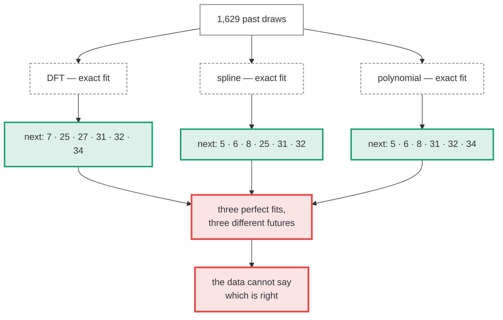

# The perfect-fit function

!!! abstract "The concept, in a minute"

    **The idea.** Somewhere there is a function whose curve passes through every past draw;
    evaluate it one step further and you have the next one. Infinitely many functions fit
    the past — but only one also fits the next draw, so find a way to pick it.

    **How it works.** We build three genuinely exact fits — Fourier interpolation through
    the whole history, a cubic spline, a window polynomial — and evaluate each at
    tomorrow's index.

    **What it teaches.** All three reproduce the past perfectly and *disagree about the
    future* — the prediction comes from the choice of basis, not from the data. Picking the
    right continuation costs 23.96 bits per draw, and compressing the archive shows it
    contains ~none of them: a fair sequence is its own shortest description. Punchline: the
    smoothest function through fourteen years of draws predicts, as the next draw, the
    draw of 2012-01-03. A perfect fit is a lookup table wearing a curve.

*There must exist a function over time that passes through every past draw — infinitely
many, in fact. Only one of them also passes through the next draw. Find a way to describe
that space, and you have a predictor.*

This is the most natural formulation of lottery prediction there is, and it deserves the
most careful treatment on this site — because **every part of the premise is true**. Such
functions exist. We build three of them below — two fitting all 1,629 draws to machine
precision, one fitting its recent window exactly. The failure, when it comes, is not
philosophical hand-waving: it is a specific, measurable step, and this page measures it.

  <i></i>data
  <i></i>fixed operation
  <i></i>output
  <i></i>where it breaks

## Granting the premise

In `bench/spacetime.py`, three function families, each an *exact* fit:

| Family | Construction | Max error on all past draws |
|---|---|---:|
| **DFT** | trigonometric interpolation through the whole history — the unique minimal-bandwidth function through all the points | 5×10⁻⁷ |
| **Spline** | natural cubic spline, one knot per draw | 0 (exact at every knot) |
| **Polynomial** | degree-5 polynomial through the last six draws — exact on its window only, for people who feel the full history is "too old to matter" | 7×10⁻¹³ (window) |

No strawmen: the DFT and spline genuinely reproduce every one of the 1,629 past draws, and
the polynomial its window. Asked about a past date they cover, they answer perfectly. The
premise "a function that fits perfectly on the past draws" is delivered in full.

## The step where it breaks

Now ask each one for the **next** draw.

Three exact fits, three different answers — pairwise agreeing on only 3 to 5 of 6 numbers.
If the past determined the continuation, exact fits would have to agree about it. They
don't, because fitting the past and knowing the future are different operations, and only
the first is constrained by the data.

Each family's answer is also individually instructive:

- **The DFT predicts the draw of 2012-01-03.** Not approximately — identically. Every
  Fourier basis function has period *n*, so \(f(n) = f(0)\) exactly: the unique
  minimal-bandwidth function through fourteen years of draws says the next draw is the
  first one. That is not a defect of the Fourier transform. It is what "the data does not
  constrain the continuation" looks like once a basis is forced to commit.
- **The spline extrapolates "probabilities" from −7.2 to +10.9.** It matched every observed
  0 and 1 perfectly and still has no idea what a probability is, because nothing in exact
  fitting ever required it to.
- **The polynomial spans −16 to +32** one step past its window, because a degree-5
  polynomial leaving its data does what polynomials do.

The choice of *basis* fully determines the prediction, and the basis is chosen by you, not
by the data. Whatever you pick, you are not extracting the continuation from the past — you
are supplying it.

## Counting the missing information

"Only one function fits the next draw" — true. Selecting it from the infinite family
requires information, and information is countable:

\[
\log_2\!\left[\binom{37}{6} \times 7\right] = 23.96 \text{ bits per future draw}
\]

So the question becomes empirical: **how many of those bits does the archive contain?** If
the draws were produced by *any* function simple enough for a general-purpose compressor to
model — periodicity, arithmetic structure, drifting rates, seasonal cycles — the canonically
packed archive would compress below its entropy floor.

| Sequence | zlib size | vs the 23.96-bit floor |
|---|---:|---:|
| The real archive (1,629 draws) | 24.05 bits/draw | **100.4%** — incompressible |
| 200 simulated fair histories | 24.05 bits/draw mean | identical to the real one |
| A control actually generated by a simple function | **3.70 bits/draw** | **15.5%** |

(The suite uses zlib because its 201-encode Monte-Carlo null costs ~10 ms against minutes
for lzma preset 9; lzma agrees where it counts — 101.4% of floor on the real archive,
10.4% on the control.)

The control matters: it proves the test can see a generating function when one exists. On
the real archive it finds nothing — the past contains approximately **zero** of the 23.96
bits per draw that selecting the right continuation requires. This runs as a standing
test in the [randomness suite](../evaluation.md), Monte-Carlo calibrated, and
`test_compression_detects_a_generator` keeps the negative control honest.

And note the regress even granting a success: had the next draw arrived and matched one
family, you would stand before *n + 1* points with infinitely many exact fits through
them, disagreeing at *n + 2*. "The function that fits the next draw" is only identifiable
after the draw — at which point it has predicted nothing.

## Measured

Walk-forward over 300 held-out draws, like every other approach here:

| Family | In-sample fit | Walk-forward matches | p |
|---|---:|---:|---:|
| DFT | exact | 1.047 | 0.128 |
| Spline | exact | 0.997 | 0.624 |
| Polynomial | exact (window) | 0.990 | 0.725 |
| Chance | — | 0.973 | — |

The now-familiar shape: perfect on the past, chance on the future. It is the
[date-conditioned model's](date-conditioned.md) lesson in a different costume — there, a
unique date key let a table *store* the answers; here, an interpolation basis does the
storing. An exact fit **is** a lookup table, whether it is written as 1,629 rows or as
1,629 Fourier coefficients. Same number of stored quantities, same out-of-sample value:
none.

## Why this page earns its place

Because the premise is the strongest version of the folk theory, and it fails *honestly* —
not because functions through the data don't exist, but because:

1. **Exact fit is free.** Interpolation is always possible and therefore carries no
   information about anything beyond its points.
2. **Selection is the entire problem**, it costs 23.96 bits per future draw, and the
   archive measurably contains none of them.
3. **Any specific basis smuggles in the answer** — the prediction changes when the basis
   does, while the data stays the same.

If the draw were even slightly unfair, this framework would work: the bias would be
structure, structure is compressible, the compressor would find it, and the perfect-fit
families would begin to agree with each other where the bias lives. Every instrument on
this page is capable of detecting that world. We are just not in it.

---

Full scoreboard: [Results](../results.md).
