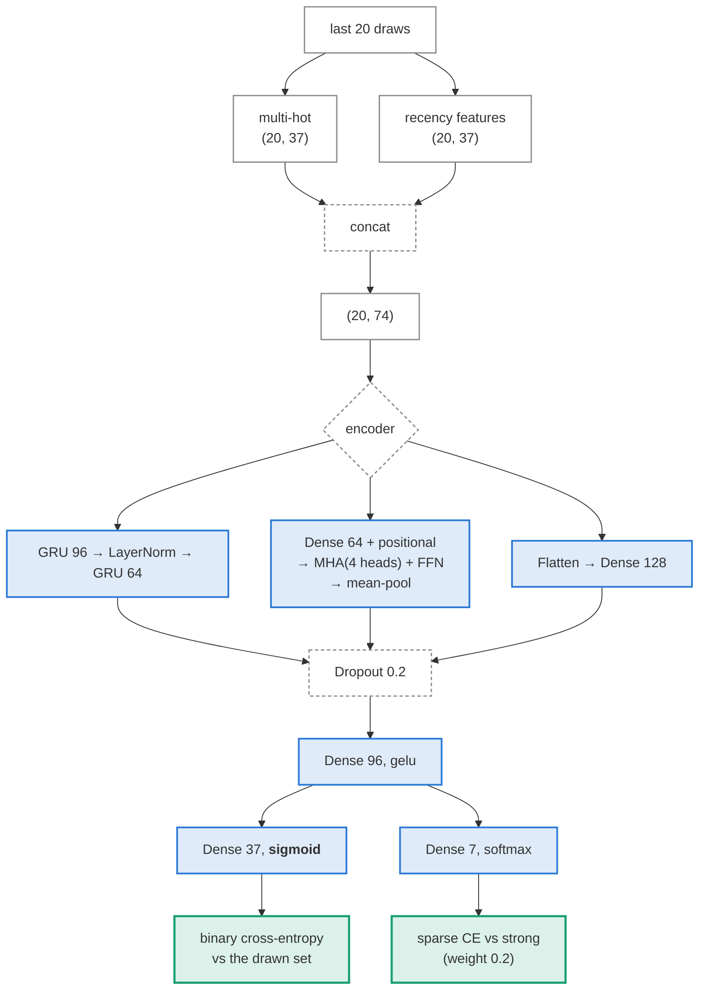
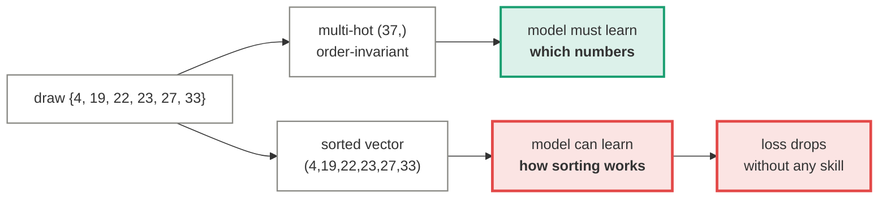
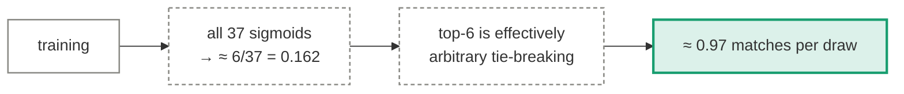

# Neural set prediction

In `bench/nn.py`. Three interchangeable encoders — GRU, Transformer, MLP — behind one input
encoding and one dual output head. The architecture choice is deliberately the *only*
variable, so the comparison says something about architectures rather than about
preprocessing.

<div class="role-key">
  <span class="k-data"><i></i>tensors</span>
  <span class="k-learn"><i></i>learned weights</span>
  <span class="k-op"><i></i>fixed operation</span>
  <span class="k-out"><i></i>output</span>
</div>

## The whole model



## Why sigmoid and not softmax

This is the design decision that separates this model from
[the legacy ones](legacy-models.md).

A draw is an **unordered set** of six numbers. The published data lists them ascending, but
that ordering is an artefact of presentation, not of the machine.

=== "Set prediction (here)"

    37 independent sigmoids, trained with binary cross-entropy against a multi-hot target.

    \[
    \mathcal{L} = -\sum_{b=1}^{37} y_b \log \hat p_b + (1 - y_b)\log(1 - \hat p_b)
    \]

    Output \(\hat p_b\) is "probability number \(b\) is in the next draw". Permuting the
    target changes nothing. To score well the model has to know *which numbers*.

=== "Position softmax (legacy)"

    7 softmaxes, one per sorted position, trained with categorical cross-entropy.

    Position 1 is the minimum of six draws from 1–37, so its distribution is sharply
    concentrated on small numbers; position 6 on large ones. A model can drive the loss down
    a long way by learning **the marginal distribution of each order statistic** — which is
    a property of sorting, not of the lottery.

    This is where the old "30% top-10 accuracy" came from.



## The input encoding

Each past draw becomes 74 numbers, not 7 ball IDs:

| Channel | Shape | What it carries |
|---|---|---|
| multi-hot | `(20, 37)` | which numbers came up, order-free |
| recency | `(20, 37)` | draws since each number last appeared, scaled to `[0, 1]` |

Feeding integer ball IDs instead would hand the network the sort order again through the
back door, and would force it to spend capacity rediscovering "number 14 is one more than
number 13" — a relationship that carries no meaning in a lottery.

The output bias is initialised at \(\operatorname{logit}(6/37)\), so the model starts already
calibrated on the base rate instead of spending its first epochs learning the prior.

## What it learns

It converges on the uniform prior — which is the correct answer, and the reason it is worth
publishing.



Validation loss plateaus around 0.833 within a few epochs and does not improve with more
capacity, more history, or either encoder. Three architectures failing the same way is
stronger evidence than one succeeding.

## What was fixed from the old model

The rewrite was not only about the target. Four bugs in the original training setup:

!!! bug "The learning-rate schedule cancelled itself"

    ```python
    # old: multiplies the CURRENT lr each epoch
    return lr * (epoch + 1) / warmup_epochs
    ```

    Intended as warm-up, this compounds: `lr × 0.1 × 0.2 × 0.3 …`, driving the rate to
    ~1e-9 within ten epochs. `ReduceLROnPlateau` was simultaneously mutating the same
    variable. Both are gone; only plateau-based reduction survives.

!!! bug "`recurrent_dropout` forced the slow path"

    Combined with `return_state`, it takes Keras off the fused kernel — one to two orders of
    magnitude slower, for no measured benefit. The whole 13-strategy report now builds in
    ~80 seconds.

!!! bug "Gaussian noise on categorical IDs"

    The "augmentation" added \(\mathcal{N}(0, 0.01)\) to integer ball IDs, clipped, and cast
    back to `int32` — reproducing the input almost exactly. It doubled epoch time and added
    nothing.

!!! bug "Layers constructed inside `call()`"

    `Lambda` and `Concatenate` were being instantiated on every forward pass.

---

Measured results: [Results](../results.md).
