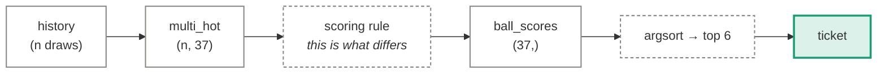
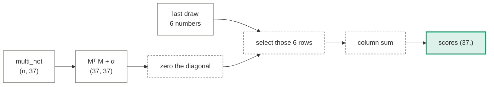

# Statistical strategies

Eleven counting rules, in `bench/predictors.py`. None of them trains anything — each is a
deterministic function from history to a 37-vector of scores. That makes them the cleanest
possible test of lottery folklore: if "hot numbers" meant anything, this is where it would
show up.

Each one below gets the same treatment: what it believes, how it computes, **the specific
mechanism by which it fails**, and what it actually scored. "It doesn't work" is not an
explanation; every failure here has a different shape.

  <i></i>data
  <i></i>fixed operation
  <i></i>output

## The shared contract

Every strategy plugs into the same socket, which is why they are directly comparable.

---

## Hot numbers

**Believes:** numbers drawn often will keep being drawn often.

Counts appearances over a window and picks the six highest:
\(\text{score}(b) = \sum_{t \in \text{window}} \mathbb{1}[b \in \text{draw}_t]\).

### Why it fails

The premise is that the frequency table reflects a *propensity*. It reflects binomial noise.

Over 1,629 draws each number is expected 264.2 times with a standard deviation of 14.9. The
observed counts run 231 to 301 — a range of **70**. Simulating fair draws gives a mean range
of **63.3** with a 95% interval of **[46, 86]**. So the spread that makes some numbers look
hot is not merely compatible with fairness; it is the *typical* amount of spread fairness
produces. The hottest number sits 2.48 sd above the mean, and the maximum of 37 draws from a
normal distribution sits around 2.3 sd above by construction.

The decisive test is not whether the spread exists but whether it **persists**. It does not:

| | |
|---|---|
| Rank correlation of per-number counts, first half vs second half | **ρ = +0.18** (p = 0.28) |
| Hottest 6 of the first half → their mean count in the second half | **131.3**, against an all-number mean of 132.2 |
| A ticket of those 6 played through every second-half draw | **0.967** matches — *below* chance (0.973) |

The six hottest numbers of the first half went on to slightly **underperform** the average.
Whatever made them hot did not survive into the second half, because there was nothing to
survive.

!!! quote "Measured"
    Hot (last 100): **1.067** matches, p = 0.053, log loss 3.635 — *worse* than uniform's 3.611.
    Hot (all-time): **1.010**, p = 0.444.

## Cold numbers

**Believes:** numbers that are behind must catch up.

Identical machinery, negated.

### Why it fails

This is the gambler's fallacy stated precisely enough to test. It requires the machine to
remember what it has already produced and compensate — physically, that a ball drawn less
often is somehow more available. The lag-1 test measures exactly this: P(drawn again |
drawn last time) = **0.1650** against 0.1622 expected. The bias, such as it is, points the
*wrong way* for cold numbers.

It also gets no log loss, and the reason is instructive: its scores are all negative, so
normalising them into a distribution collapses everything to the uniform prior. It would
report exactly the baseline no matter how it ranked. See
[the scoring rules](../evaluation.md#the-two-scoring-rules).

!!! quote "Measured"
    **0.967** matches, p = 0.896. Log loss withheld.

## Overdue

**Believes:** the longer a number has been absent, the more it is "due".

Scores by draws elapsed since last appearance.

### Why it fails

Because appearances are **memoryless**, which is directly visible in the data. Bucketing
every (number, draw) pair by how long that number had been absent:

| Draws since last seen | Observations | P(drawn) | vs 6/37 |
|---|---:|---:|---:|
| 0 (drawn last time) | 9,768 | 0.1656 | +0.93 sd |
| 1–2 | 14,971 | 0.1630 | +0.29 sd |
| 3–5 | 14,440 | 0.1614 | −0.26 sd |
| 6–9 | 10,523 | 0.1582 | −1.10 sd |
| 10–14 | 6,168 | 0.1618 | −0.08 sd |
| 15+ | 4,145 | 0.1653 | +0.54 sd |

Flat. A number absent for fifteen draws is no more likely than one drawn last time — if
anything marginally less. The gap distribution being geometric *is* the signature of
memorylessness, and the [randomness suite](../evaluation.md) confirms it (p = 0.43).

!!! quote "Measured"
    **1.017** matches, p = 0.366.

## EWMA frequency

**Believes:** recent draws matter more than old ones. A draw \(k\) back carries weight
\(0.5^{k/h}\), half-life \(h = 50\).

### Why it fails

For the same reason as hot numbers — but it adds a second problem worth naming. The
half-life is a **free parameter**. Sweeping it until the backtest improves is the garden of
forking paths: with enough values, one will look good on 300 draws by chance alone. The
half-life here was fixed at 50 in advance and never tuned, which is why its result can be
read at face value.

!!! quote "Measured"
    **1.027** matches, p = 0.267, log loss 3.630 — again worse than uniform.

## Pairwise co-occurrence (Markov)

**Believes:** the machine has mechanical memory — some balls travel together. Builds a 37×37
co-occurrence matrix and scores numbers by how often they appeared alongside the last draw.

### Why it fails

This one fails through **multiplicity**, and it is the clearest example on the site.

There are 666 pairs. The most extreme is 13 & 25, co-occurring 59 times against 36.7
expected — **z = +3.73**, a naive p of 0.0002. That looks like a finding.

It is not, because you did not pick that pair in advance; you picked the most extreme of 666.
Drawing 666 pure-noise values and taking the largest gives **|z| ≈ 3.33** on average. Our
"striking" 3.73 is barely beyond what noise hands you by construction. Šidák-corrected across
the family: **p = 0.122**.

!!! quote "Measured"
    **0.980** matches, p = 0.884.

## Lag-1 persistence

**Believes:** whether a number appeared last time changes its odds this time. Estimates two
smoothed conditionals per number:

\[
\hat p_{\text{in}}(b) = \frac{\#\{b \in t-1 \wedge b \in t\} + \alpha}{\#\{b \in t-1\} + 2\alpha}
\qquad
\hat p_{\text{out}}(b) = \frac{\#\{b \notin t-1 \wedge b \in t\} + \alpha}{\#\{b \notin t-1\} + 2\alpha}
\]

### Why it fails

Both estimates converge to \(6/37\). The pooled contingency test gives p = 0.42 — the two
conditionals are the same number to within noise, so the strategy is ranking by an estimate
whose true value is constant across all 37 balls. What remains is estimation error, and the
top six are simply whichever balls got the luckiest smoothing.

This one finished second, at p = 0.062. Which is a good moment to note that **fourteen
strategies were tested**: see [the scoreboard trap](#the-scoreboard-trap) below.

!!! quote "Measured"
    **1.063** matches, p = 0.062, log loss 3.613 — still above uniform's 3.611.

## Rank ensemble

**Believes:** averaging independent signals helps.

### Why it fails

Ensembling helps when components carry **independent** information. These do not — they are
different arithmetic on the same counts:

| | |
|---|---|
| Mean pairwise rank correlation between members | **+0.24** |
| Maximum pairwise correlation | **+0.91** |

Hot-all-time and EWMA correlate at 0.91 because they are the same statistic with different
weights. Averaging correlated noise gives you the same noise with a smaller variance — it
concentrates the estimate, it does not create signal. There was no signal to concentrate.

!!! quote "Measured"
    **1.013** matches, p = 0.404. Log loss withheld (ranks are not probabilities).

## Sum-targeted combination

**Believes:** nothing, deliberately. Draw sums cluster near 114, so it picks a combination
summing near the mode.

### Why it fails

It does not fail — it was never trying. Every 6-number combination has probability
\(1/\binom{37}{6}\) regardless of its sum. Sums cluster because *many combinations* share a
middling sum, not because those combinations are favoured. It is here as a control, to show
what a strategy that changes the ticket without changing the odds scores.

!!! quote "Measured"
    **0.930** matches, p = 0.374.

## Random ticket

**Believes:** correctly.

Six uniform picks, entered as a full participant. It has finished **above** several
strategies that claim to know something. That is not a defect in them — it is the size of the
noise, made visible.

!!! quote "Measured"
    **0.933** matches, p = 0.413.

---

## The scoreboard trap

Two strategies on the current board sit near p = 0.05. It would be easy to write up the
first one. Look at both:

| Strategy | Matches | p |
|---|---:|---:|
| Hot numbers (last 100) | 1.067 | **0.053** |
| … | | |
| Neural (transformer) | 0.853 | **0.013** |

The **most statistically extreme result on the board is a model performing significantly
_worse_ than chance** — and at a smaller p-value than the best one. Nobody would propose the
transformer as evidence of anti-predictive power, or go looking for the mechanism by which a
neural network avoids the right numbers.

The same scepticism has to apply to the other end. Fourteen strategies drawn from a null
distribution will scatter on both sides, and the extremes of that scatter are what these two
numbers are. Holm–Bonferroni formalises the intuition; the transformer makes it obvious.

---

Full scoreboard: [Results](../results.md).
