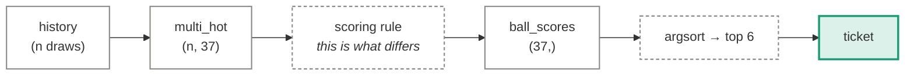
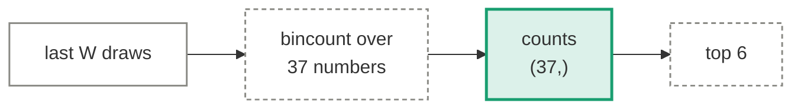
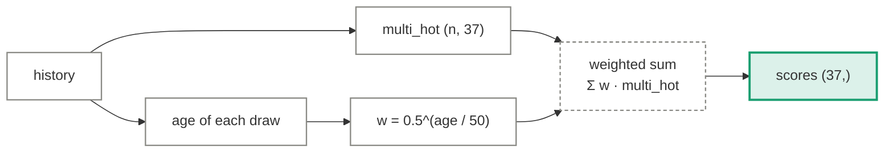
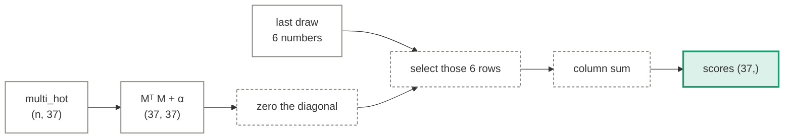
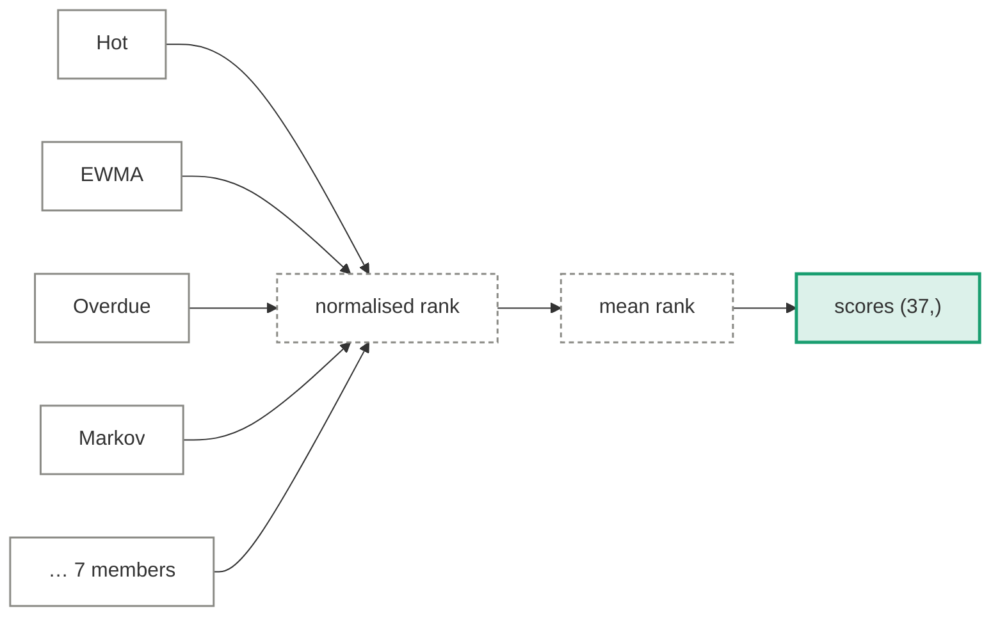

# Statistical strategies

Eleven counting rules, in `bench/predictors.py`. None of them trains anything — each is a
deterministic function from history to a 37-vector of scores. That makes them the cleanest
possible test of lottery folklore: if "hot numbers" meant anything, this is where it would
show up.

  <i></i>data
  <i></i>fixed operation
  <i></i>output

## The shared contract

Every strategy plugs into the same socket, which is why they are directly comparable.

---

## Hot numbers

**Believes:** numbers drawn often will keep being drawn often.

Counts appearances over a window (all-time, or the last 100 draws) and picks the six
highest.

\[
\text{score}(b) = \sum_{t \in \text{window}} \mathbb{1}[b \in \text{draw}_t]
\]

Counts normalise to a genuine categorical distribution, so this strategy **does** get a log
loss. It scores worse than uniform.

## Cold numbers

**Believes:** numbers that are behind must catch up.

Identical machinery, negated. That negation is why it gets no log loss — see
[the scoring rules](../evaluation.md#the-two-scoring-rules) — and it is a good illustration of
why a metric has to be earned rather than computed.

## EWMA frequency

**Believes:** recent draws matter more than old ones.

A draw \(k\) draws ago carries weight \(0.5^{k/h}\) with half-life \(h = 50\). It smoothly
interpolates between "hot recently" and "hot all-time", which means it also spans the whole
family of window choices a person might have tuned to.

## Overdue

**Believes:** the longer a number has been absent, the more it is "due" — the gambler's
fallacy, stated precisely so it can be measured.

Scores each number by draws elapsed since its last appearance. Included because it is the
most common thing real players actually do.

## Pairwise co-occurrence (Markov)

**Believes:** the machine has mechanical memory — some balls travel together.

Builds a 37×37 co-occurrence matrix over all history, then scores each number by how often
it appeared *alongside* the numbers in the most recent draw.

The corresponding hypothesis test — every one of the 666 pairs, Šidák-corrected — is in the
[randomness suite](../evaluation.md), and it does not fire.

## Lag-1 persistence

**Believes:** whether a number appeared last time changes its odds this time.

Distinct from the pairwise version: that one is co-occurrence *within* a draw, this is
persistence *across* draws. For each number independently it estimates two smoothed
conditional probabilities and picks whichever applies.

\[
\hat p_{\text{in}}(b) = \frac{\#\{b \in t-1 \wedge b \in t\} + \alpha}{\#\{b \in t-1\} + 2\alpha}
\qquad
\hat p_{\text{out}}(b) = \frac{\#\{b \notin t-1 \wedge b \in t\} + \alpha}{\#\{b \notin t-1\} + 2\alpha}
\]

These are real inclusion probabilities, so this strategy is scored on log loss too. Both
estimates land on \(6/37\) to within noise, which is the whole story.

## Sum-targeted combination

**Believes:** nothing, deliberately. It is a control.

Draw sums cluster near 114, so this picks a combination summing near the mode. That changes
*which* ticket you hold, never the probability it wins — which is exactly the point of
including it next to strategies that claim more.

## Unpopular numbers

**Believes:** other players are predictable, even though the machine is not.

The only strategy here whose logic is sound. See
[ticket generators](ticket-generators.md) for the full treatment.

## Rank ensemble

**Believes:** averaging independent signals helps.

Averages the normalised ranks of the seven statistical members. Ensembling genuinely helps
when the components carry independent information — so this is a useful check. If the parts
are noise, the average is noise, and that is what the numbers show.

## Random ticket

**Believes:** correctly.

Six uniform picks. It is in the table as a full participant, and it has finished *above*
several of the strategies above. That is not a bug in those strategies — it is the size of
the noise, made visible.

---

Measured results for all of these: [Results](../results.md).
