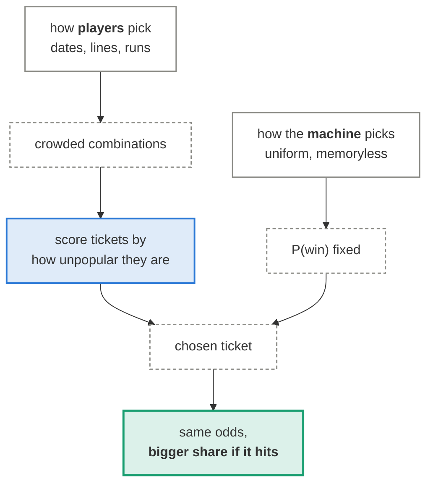
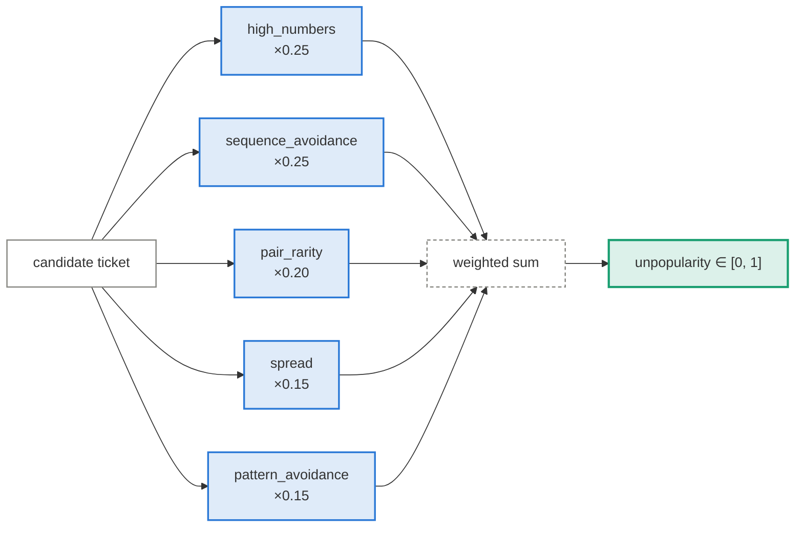
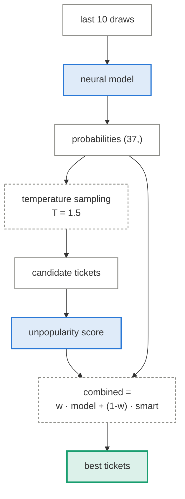
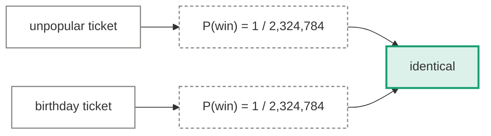

# Ticket generators

!!! abstract "The concept, in a minute"

    **The idea.** You cannot change *whether* you win — every combination has identical
    odds. But prizes are pots split among winners, so you can change *how much* you win by
    holding a ticket nobody else holds.

    **How it works.** Score candidate tickets by how unlike human picks they are: humans
    play birthdays (1–31), visual patterns and arithmetic runs, so reward high numbers,
    even spread, and no sequences. Play the least popular-looking ticket.

    **What it teaches.** This is the single genuine edge in the repository — and it is a
    fact about *players*, not about the machine. It raises the expected payout given a win
    while leaving the odds untouched, and the expected value of a ticket stays negative
    either way. Everything that claims to predict fails; the one thing that works does not
    predict anything.

In `smart_generator.py` and `predict.py`. These are the only approaches in the repo that can
raise expected value — and they do it without predicting anything.

  <i></i>data
  <i></i>learned / scored
  <i></i>fixed operation
  <i></i>output

## The idea

The Israeli Lotto is **pari-mutuel**: each prize tier is a pot divided among the tickets that
hit it. Your probability of hitting is fixed by combinatorics and identical for every
combination. What is *not* fixed is how many people you share with.

\[
\mathbb{E}[\text{payout}] = \underbrace{P(\text{win})}_{\text{same for all tickets}} \times \underbrace{\mathbb{E}\!\left[\frac{\text{pot}}{1 + \text{co-winners}}\right]}_{\textbf{this is choosable}}
\]

Players are not uniform. They pick birthdays, they pick straight lines on the slip, they pick
runs. Those combinations are massively over-subscribed, so a ticket that avoids them wins
just as often and shares less.

!!! note "This is a claim about people, not about randomness"

    Nothing here contradicts the rest of the site. The draw stays unpredictable; the
    *population of tickets* is what is being exploited.

## The unpopularity score

`TicketScorer.score_ticket` combines five components into a weighted total in `[0, 1]`:

| Component | Weight | Rewards | Grounded in |
|---|---:|---|---|
| `high_numbers` | 0.25 | including numbers above 31 — outside the calendar range | player behaviour |
| `sequence_avoidance` | 0.25 | no arithmetic progressions (`4, 8, 12, 16` is a popular pick) | player behaviour |
| `pattern_avoidance` | 0.15 | not matching known slip patterns (lines, diagonals) | player behaviour |
| `spread` | 0.15 | even gaps and wide range coverage, rather than clustering | player behaviour |
| `pair_rarity` | 0.20 | pairs that co-occurred rarely **in past draws** | nothing — see below |

!!! warning "`pair_rarity` does not measure popularity"

    `TicketScorer._analyze_historical_patterns` builds `pair_frequencies` by counting pairs in
    the **draw archive** — the machine's output, not anybody's ticket. Which pairs the machine
    happened to draw says nothing about which pairs players choose, and the
    [pairwise co-occurrence test](../evaluation.md) confirms those counts are consistent with
    chance. So this component contributes 20% of the weight and carries no information in
    either direction.

    Fixing it properly needs data this repo does not have: the distribution of *submitted
    tickets*, or winner counts per tier as a proxy. Until then the four behavioural components
    are what the argument rests on, and `pair_rarity` is noise diluting them.

The other four are grounded in documented human picking behaviour rather than in the draw
history, which is what makes them sound.

## The hybrid generator

`smart_generator.py --model multi_output` blends a network's probabilities with the
unpopularity score:

Worth being straight about what each half contributes. The model half is measurably worthless —
that is what [the benchmark](../results.md) shows. The behavioural half is sound.

!!! note "`--model-weight 0` is not a pure-smart mode"

    The weight only drops `model_score` out of the final **ranking**. Every candidate ticket is
    still *sampled* from the model's probability distribution — `generate_hybrid_tickets` calls
    `get_model_probabilities` before the loop and draws all six balls from it regardless of the
    weight. So the model still decides which tickets are ever considered.

    In practice this costs little, because the model's distribution is almost uniform, so
    sampling from it is close to sampling at random. But "weight 0 removes the model" is not
    true of the current code. A genuine pure-smart path would sample candidates uniformly;
    `smart_generator.py --count N` with no `--model` does exactly that.

Temperature sampling is doing real work though: it stops the generator returning the same six
numbers every time, which matters because a deterministic generator that many people ran would
itself become a crowded pick.

## What this does not do

The expected value of a Lotto ticket remains negative — roughly half of ticket revenue is
returned as prizes. Choosing unpopular numbers makes a losing proposition slightly less
losing, conditional on the rare win. It does not make it a winning one.

---

Measured results: [Results](../results.md).
