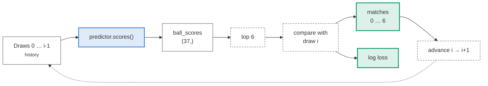
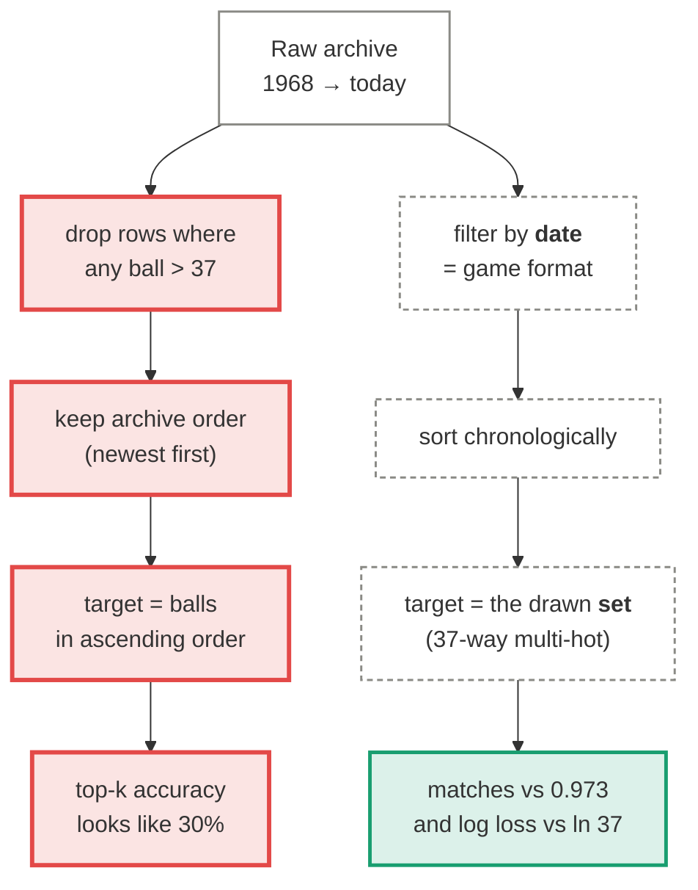
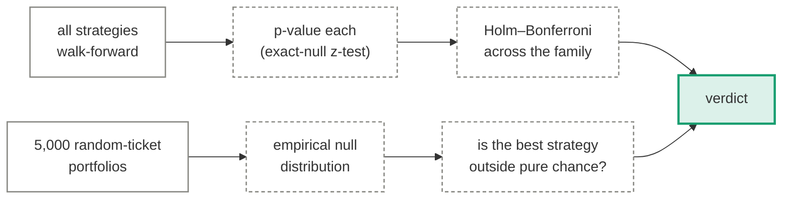

# How every approach is measured

Before any architecture matters, the measuring apparatus has to be right. Most of the
apparent skill this repo used to report came from the harness, not the models — so this
page comes first.

  <i></i>data / tensors
  <i></i>learned weights
  <i></i>fixed operation
  <i></i>output
  <i></i>unsound step

## The walk-forward loop

Every strategy implements one method, `scores(history) -> (ball_scores[37], strong_scores[7])`.
The harness calls it once per draw in the test window, handing it **only the draws that came
before**. There is no train/test split to get wrong, and no way to see the future.

A model with a `fit` step is refit every `refit_every` draws, always on history only. The
`test_walk_forward_never_sees_the_future` test asserts the exact sequence of history
lengths the harness produces, so a leak becomes a named test failure.

## The two scoring rules

=== "Matched numbers"

    How many of the six picked numbers were drawn. The null is exact: a random ticket is a
    hypergeometric draw, so

    \[
    \mathbb{E}[\text{matches}] = \frac{6 \times 6}{37} = 0.9730
    \]

    That constant is the bar every bar chart is drawn against.

=== "Log loss"

    A **proper** scoring rule: it grades the whole distribution a strategy assigns, not just
    its top six. A uniform guess scores exactly \(\ln 37 = 3.6109\).

    It is reported **only** for strategies that emit genuine per-number inclusion
    probabilities. Normalising ranks or gaps into a distribution is an arbitrary transform;
    for all-negative scores it collapses to the uniform prior and would report exactly the
    baseline no matter how the numbers were ranked. Predictors declare this with
    `emits_probabilities`.

## Why the old numbers looked good

Three properties of the data conspired to make a model that knows nothing look like it knew
something. All three are fixed, and each has a regression test.

**The value filter was a selection on the outcome.** Dropping every draw containing a number
above 37 does not remove a different game — it removes precisely the draws that contained
high numbers, and keeps the low ones. In the pre-2004 era that discarded roughly 2,000 of
2,100 draws and biased the surviving frequency table downward. Filtering by *date* removes
the same eras without touching the outcome.

**Ascending order leaks.** `Ball_1` is the minimum of six draws from 1–37, `Ball_6` the
maximum. A model that memorises the marginal distribution of each order statistic scores
well on per-position top-k while knowing nothing about which numbers come up. Every metric
here is order-invariant.

**Reverse chronological order.** The archive ships newest-first. Consuming it as-is builds
windows that predict the past from the future.

## Guarding against the luckiest strategy

Every strategy is backtested together. The highest of a dozen-odd noisy numbers is high by
construction, so two corrections apply:

The Monte-Carlo null is the honest yardstick: the luckiest of 5,000 *purely random*
strategies has outscored the best "real" one in every rebuild so far.

The verdict covers **both** families — the strategy table and the randomness tests. A
significant randomness test with no significant predictor is still a change in draw
behaviour, and is exactly what this site exists to catch.

---

Next: [what each approach actually does →](approaches/index.md)
