# ILotto

An honest benchmark of lottery-prediction methods against the Israeli Lotto (6/37 + strong
1–7), with every approach in the repository documented, diagrammed, and scored against the
same exact null.

[Open the live benchmark report](benchmark/index.html){ .md-button .md-button--primary }
[How each approach works](approaches/index.md){ .md-button }

---

## The short version

Thirteen strategies — counting heuristics, Markov models, GRU and Transformer networks —
are backtested walk-forward against 1,600+ draws. **None beats a randomly filled ticket by a
margin that survives correcting for the number of strategies tried, and none beats a uniform
guess on log loss**, meaning none holds information about the next draw even in principle.

That is the expected answer. The value here is the measurement:

```mermaid
flowchart LR
  D["draw archive<br/>1968 → today"] --> E["era filter <b>by date</b><br/>1,600+ draws, one game"]
  E --> W["walk-forward<br/>no lookahead"]
  W --> M["matches vs 0.973<br/>log loss vs ln 37"]
  M --> C["Holm–Bonferroni<br/>+ Monte-Carlo null"]
  C --> R["published report,<br/>rebuilt after every draw"]

  class D data
  class E,W,M,C op
  class R out
  classDef data fill:none,stroke:#8a8a85,stroke-width:1.5px
  classDef learn fill:#2a78d626,stroke:#2a78d6,stroke-width:2px
  classDef op fill:none,stroke:#8a8a85,stroke-width:1.5px,stroke-dasharray:4 3
  classDef out fill:#199e7026,stroke:#199e70,stroke-width:2.5px
  classDef flaw fill:#e3494826,stroke:#e34948,stroke-width:3px
```

## Where to start

- :material-scale-balance: **[How it is measured](evaluation.md)**

    The walk-forward harness, the two scoring rules, and the three data bugs that made the
    old numbers look like signal.

- :material-shape-outline: **[The approaches](approaches/index.md)**

    Diagrams and explanations for every method: statistical rules, neural set prediction,
    the four legacy sequence models, and the ticket generators.

- :material-chart-box-outline: **[Results](results.md)**

    The current scoreboard, regenerated from the latest run.

- :material-book-open-variant: **[Reference](reference/architectures.md)**

    Layer-by-layer deep dive and the full user guide.

## The one real edge

Nothing predicts the draw. But prizes are split among winners and players over-pick calendar
dates, so a ticket weighted toward 32–37 wins no more often and *shares less when it does*.
That is a payout effect, not a prediction effect — see
[ticket generators](approaches/ticket-generators.md).

!!! warning "Not gambling advice"

    The expected value of a Lotto ticket is negative regardless of which numbers are on it.
    This project concludes that the game is fair and unpredictable; it is published as a
    worked example of measuring that claim properly.
